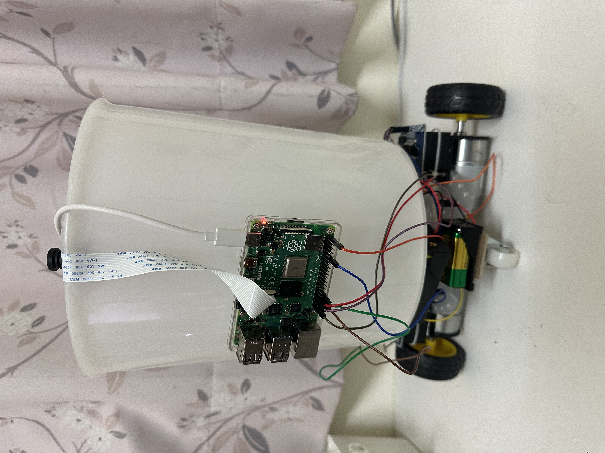
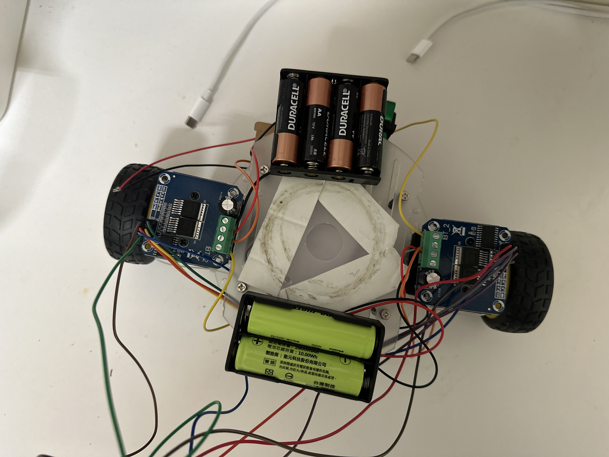
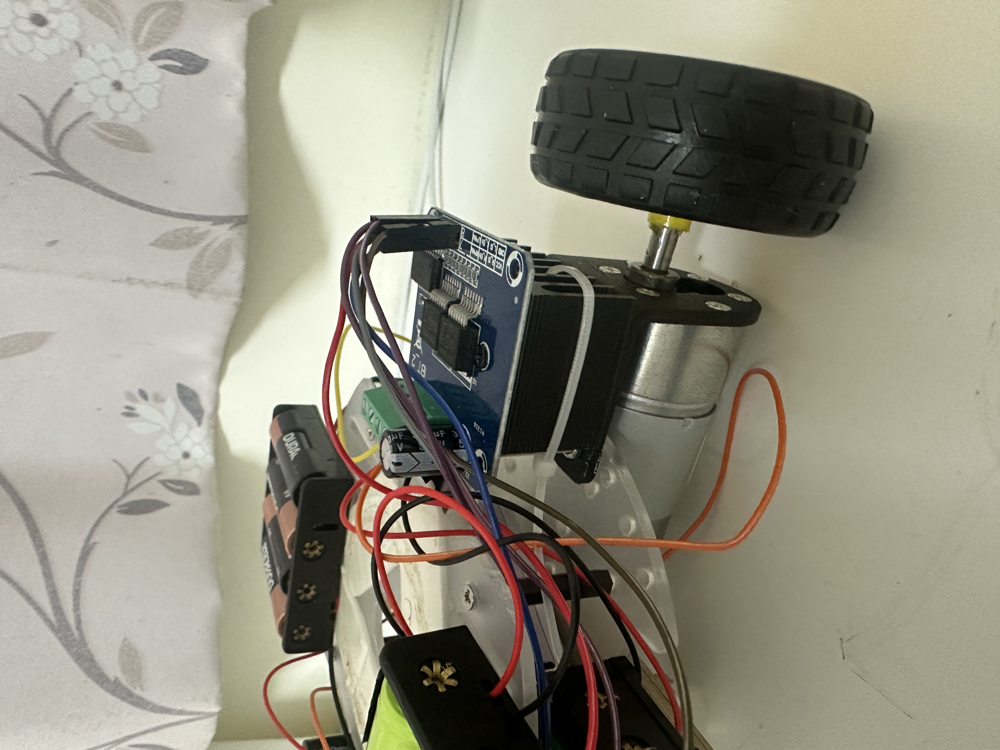
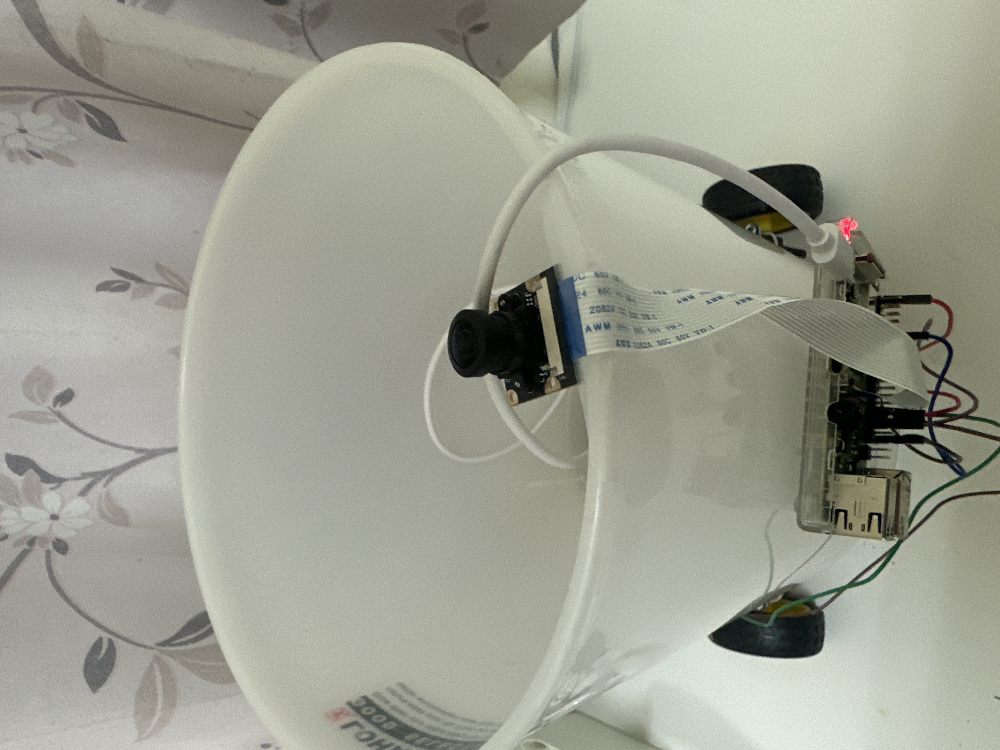
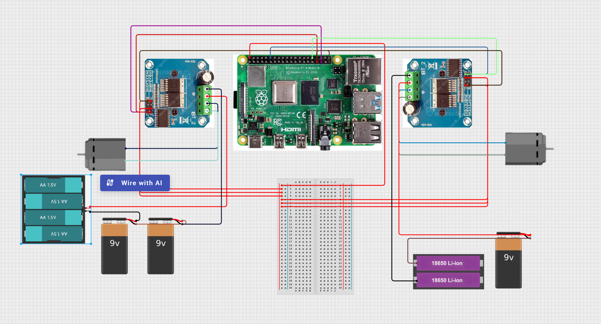
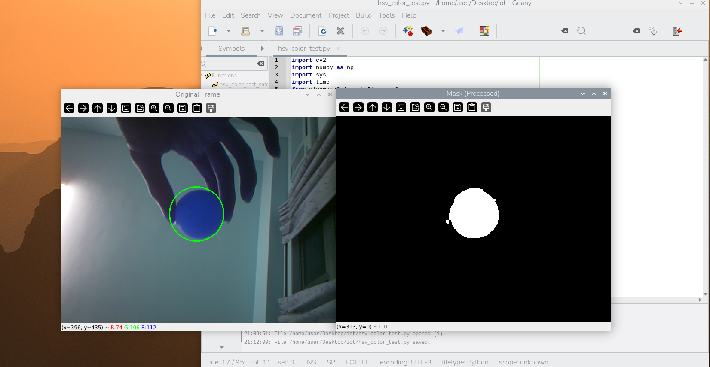

# 自動接垃圾垃圾桶（Smart Moving Trash Can）

---

## 1. 關於專案

本專案為一台**自動接垃圾垃圾桶**，透過樹莓派與攝影機進行影像辨識，當系統偵測到使用者手中持有垃圾時，垃圾桶會自動移動到使用者附近，讓使用者可以更方便地丟垃圾。  
>#### 本專案以乒乓球代替垃圾做模擬

## 2. 專案緣由

日常生活中常常遇到手上有垃圾、但垃圾桶距離太遠或不方便靠近的情況。  
本專案希望透過機器人與影像辨識技術，讓垃圾桶能主動靠近人，提升生活便利性。

---

## 3. 專案構想

按照以下步驟，逐步完成智慧垃圾桶的雛型：

1. 建立可移動的車輛底盤  
2. 使用直流馬達與馬達驅動板控制前進、後退與轉向  
3. 安裝攝影機擷取即時影像  
4. 透過影像處理辨識垃圾或特定顏色物體  
5. 根據物體位置，自動控制垃圾桶移動靠近使用者  

---

## 4. 所需材料

1. 車輛底盤＋輪組  
2. 24V 直流減速馬達 × 2  
3. BTS7960 馬達控制板 × 2  
4. 電池模組（供應馬達電源）  
5. Raspberry Pi 4  
6. Raspberry Pi 4 不斷電 5V 供電系統(或是行動電源)  
7. 樹莓派 OV5647 攝影鏡頭模組  
   - 500 萬像素  
   - 160 度廣角  
   - 可調焦（魚眼）  
8. 垃圾桶或容器（安裝於車體上）  
9. 杜邦線、固定材料（螺絲、支架等）

---

## 5. 實體照片、各裝置細節照片

整體外觀照片：  


車輛底盤裝置細節：  



攝影機安裝位置：  


---

## 6. 電路配置

樹莓派 GPIO 接線示意圖：  


---

## 7. 程式設計、環境設置

### 設置：

- 作業系統：Raspberry Pi OS（Raspberry Pi OS Trixie基於 Debian 13）  
- 使用 Python 進行開發  
- 影像處理使用 OpenCV  
- 攝影機模組使用 Picamera2  

### 環境設置（無虛擬環境）:
> 注意：`libcamera` 在虛擬環境中可能抓不到路徑，建議直接在系統 Python 下安裝。
> 如果測試後沒問題也可在虛擬環境中進行，本專案未在虛擬環境中進行

1.**更新系統套件**
```python  
sudo apt update
sudo apt upgrade -y
```

2.**安裝 Python 與必要套件**
```python
sudo apt install python3-pip python3-dev python3-numpy -y
sudo apt install libatlas-base-dev libjpeg-dev libtiff-dev libjasper-dev libpng-dev -y
sudo apt install libavcodec-dev libavformat-dev libswscale-dev libv4l-dev -y
sudo apt install libxvidcore-dev libx264-dev -y
sudo apt install libgtk-3-dev -y
sudo apt install libatlas-base-dev gfortran -y
```
3.**安裝 OpenCV**
```python
pip3 install opencv-python
```
4.**安裝 Raspberry Pi 專用套件**
```python
pip3 install RPi.GPIO
sudo apt install python3-picamera2 -y
sudo apt install libcamera-apps -y
```
5.**其他必要套件**
```python
pip3 install numpy
```
---
### 程式設計：

#### 1.在開始之前
>### 本專案判定垃圾的方式是以色彩蒙版辨識，如要使用AI模型判定可忽略1.2.3部分
>### 建議依照步驟單元測試後再執行主程式

---

#### 2.HSV 色彩蒙版說明

在垃圾桶追蹤專案中，我們使用 HSV 色彩蒙版來辨識手上垃圾的顏色，以下說明其原理與用途。

---

#### (1) HSV 色彩空間是什麼？

HSV 是一種用來描述顏色的方式，由三個部分組成：

| 項目 | 說明 |
|------|------|
| **H (Hue，色相)** | 顏色本身，例如紅、綠、藍。數值通常 0~179（OpenCV 使用範圍 0~179） |
| **S (Saturation，飽和度)** | 顏色的純度，值越高顏色越鮮豔，值低則偏灰 |
| **V (Value，明度/亮度)** | 顏色的亮度或強度，值越高顏色越亮，值低則偏黑 |

**HSV 與 RGB 的差異：**

- **RGB** 表示紅、綠、藍三種光的強度組合，受光線影響較大。
- **HSV** 分離了顏色 (H) 與亮度 (V)，對光線變化不敏感，更符合人眼對顏色的感知。

---

#### (2) 程式中 HSV 蒙版的用途

程式片段：

```python
H_MIN = 100; H_MAX = 127
S_MIN = 175; S_MAX = 255
V_MIN = 110; V_MAX = 255
LOWER_COLOR = np.array([H_MIN, S_MIN, V_MIN])
UPPER_COLOR = np.array([H_MAX, S_MAX, V_MAX])

hsv = cv2.cvtColor(frame, cv2.COLOR_BGR2HSV)
mask = cv2.inRange(hsv, LOWER_COLOR, UPPER_COLOR)
```
功能說明：

轉換色彩空間
將攝影機捕捉的 BGR 影像轉換成 HSV：
```python
hsv = cv2.cvtColor(frame, cv2.COLOR_BGR2HSV)
```

建立顏色蒙版
```python
mask = cv2.inRange(hsv, LOWER_COLOR, UPPER_COLOR)
```
- 將在指定 HSV 範圍內的像素設為白色 (255)，範圍外設為黑色 (0)。
- 白色部分即目標顏色（例如藍色乒乓球 / 模擬垃圾）。

後續處理

- 使用 cv2.findContours 找到白色區域。
- 計算中心座標 (X, Y)。
- 控制馬達向目標移動。

#### (3) HSV 蒙版示意圖
- 原始影像：手上拿著垃圾
- HSV 蒙版後影像：目標顯示為白色區域



---

#### 3.目標物顏色測試hsv_color_test.py/hsv_color_test2.py
#### HSV 顏色範圍測試程式說明

#### (1) 功能
這個程式可以：
- 使用 Picamera2 取得即時影像
- 將 BGR 影像轉換為 HSV 色彩空間
- 利用滑條即時調整 HSV 範圍
- 顯示目標物體的蒙版與追蹤輪廓
- 幫助設定主程式的 `LOWER_COLOR` 與 `UPPER_COLOR` 參數

#### (2) 執行方式
1. 將程式上傳至樹莓派
2. 使用以下指令執行：
```python
python3 hsv_color_test.py
```
#### (3) 調整 HSV 滑條

滑條功能如下：

| 滑條   | 功能       |
|--------|------------|
| H_MIN  | 色相下限   |
| H_MAX  | 色相上限   |
| S_MIN  | 飽和度下限 |
| S_MAX  | 飽和度上限 |
| V_MIN  | 明度下限   |
| V_MAX  | 明度上限   |

操作方式：
- 調整滑條，觀察 `Mask` 視窗中的白色區域是否對應目標顏色。
- 確認後記下對應數值，作為追蹤程式的的預設數值

#### (4) 顯示與輪廓

- 程式會自動尋找蒙版中的最大輪廓。
- 以綠色圓圈標記目標物體中心。
- 可視化追蹤效果，方便微調 HSV 範圍。

#### (5) 結束程式

- 按下 `q` 鍵或使用 Ctrl+C 結束程式。
- 程式會自動釋放攝影機與關閉視窗。

>#### 確定數值後可在hsv_color_test2中測試數值正確性

---
#### 4.馬達測試 motor_test.py

本程式為 **單顆直流馬達 PWM 控制測試程式**，  
使用 Raspberry Pi GPIO 搭配 PWM 訊號，測試馬達的：

- 正轉（Forward）
- 反轉（Backward）
- 停止（Stop）
- 不同轉速（Duty Cycle）
#### PWM腳位定義
```python
RPWM = 13  # 正轉 PWM
LPWM = 19  # 反轉 PWM
```
#### 馬達控制函式
#### (1)停止馬達（Stop）
```python
def stop():
    pwmR.ChangeDutyCycle(0)
    pwmL.ChangeDutyCycle(0)
    print("STOP")

```
#### (2)正轉（Forward）
```python
def forward(speed):
    pwmR.ChangeDutyCycle(speed)
    pwmL.ChangeDutyCycle(0)

```
#### (3)反轉（Backward）
```python
def backward(speed):
    pwmR.ChangeDutyCycle(0)
    pwmL.ChangeDutyCycle(speed)

```

---
#### 5.左右輪誤差測試 motor_test2.py
#### PWM腳位定義
```python
# 左輪馬達
L_RPWM_PIN = 18 
L_LPWM_PIN = 12  

# 右輪馬達
R_RPWM_PIN = 13  
R_LPWM_PIN = 19  
```
####右輪校正因子 (初始值 1.0)
```python
# 若車子往右偏，代表左輪太快，應調降左輪或提高右輪。
# 這裡我們將以左輪 (1.0) 為基準，調整右輪的速度。
CALIBRATION_FACTOR_R = 0.6 
```
####主要校正函式
```python
def move_forward_straight(base_speed, factor_R):
    """
    自走車前進，應用右輪校正因子。
    左輪速度 = base_speed
    右輪速度 = base_speed * factor_R
    """
    speed_L = base_speed
    speed_R = int(base_speed * factor_R)
    
    # 確保速度在 0-100 範圍
    speed_L = max(0, min(100, speed_L))
    speed_R = max(0, min(100, speed_R))

    # 左輪前進 (RPWM)
    pwm_L_L.ChangeDutyCycle(0)
    pwm_L_R.ChangeDutyCycle(speed_L)
    
    # 右輪前進 (RPWM)
    pwm_R_L.ChangeDutyCycle(0)
    pwm_R_R.ChangeDutyCycle(speed_R)
    
    print(f"L_Speed: {speed_L}% | R_Speed: {speed_R}%")
```


#### 6.主程式 app.py
環境設置
```python
import cv2
import numpy as np
import time
import sys
import RPi.GPIO as GPIO
from picamera2 import Picamera2
from libcamera import controls 
```
GPIO PIN 定義與設定
```python
L_FWD_PIN = 18
L_BWD_PIN = 12
R_FWD_PIN = 13
R_BWD_PIN = 19

PWM_FREQUENCY = 1000
MAX_SPEED_DUTY = 100

pwm_L_fwd, pwm_L_bwd, pwm_R_fwd, pwm_R_bwd = None, None, None, None
```
校準與追蹤參數
```python
#影像大小
FRAME_WIDTH = 640
FRAME_HEIGHT = 480

# 已確認HSV
H_MIN = 100; H_MAX = 130; S_MIN = 140; S_MAX = 255; V_MIN = 125; V_MAX = 255
LOWER_COLOR = np.array([H_MIN, S_MIN, V_MIN])
UPPER_COLOR = np.array([H_MAX, S_MAX, V_MAX])

FLIP_CODE = 0 # 影像翻轉修正

# P-Control 參數
CENTER_X = FRAME_WIDTH // 2
CENTER_Y = FRAME_HEIGHT // 2 # Y 軸目標: 鎖定在畫面正中心 240 像素處

X_TOLERANCE = 60         # 增加 X 軸容許範圍，減少左右擺頭
Y_TOLERANCE = 0         # Y 軸容許範圍 (停止的門檻)
MAX_SPEED = 80           
MIN_SPEED = 15           # 🎯 關鍵: 固定移動/轉向速度

CALIBRATION_FACTOR_R = 0.5 #左右輪誤差調整

# =========================================================
# III. 馬達控制函式 (分階段控制)
# =========================================================
def init_motor_pins():
    global pwm_L_fwd, pwm_L_bwd, pwm_R_fwd, pwm_R_bwd
    try:
        GPIO.setmode(GPIO.BCM); GPIO.setwarnings(False)
        for pin in [L_FWD_PIN, L_BWD_PIN, R_FWD_PIN, R_BWD_PIN]:
            GPIO.setup(pin, GPIO.OUT)
        pwm_L_fwd = GPIO.PWM(L_FWD_PIN, PWM_FREQUENCY); pwm_L_fwd.start(0)
        pwm_L_bwd = GPIO.PWM(L_BWD_PIN, PWM_FREQUENCY); pwm_L_bwd.start(0)
        pwm_R_fwd = GPIO.PWM(R_FWD_PIN, PWM_FREQUENCY); pwm_R_fwd.start(0)
        pwm_R_bwd = GPIO.PWM(R_BWD_PIN, PWM_FREQUENCY); pwm_R_bwd.start(0)
        print("馬達控制腳位初始化完成。")
    except Exception as e:
        print(f"GPIO 初始化失敗: {e}"); cleanup_gpio(); sys.exit(1)

def stop():
    if pwm_L_fwd: pwm_L_fwd.ChangeDutyCycle(0); pwm_L_bwd.ChangeDutyCycle(0)
    if pwm_R_fwd: pwm_R_fwd.ChangeDutyCycle(0); pwm_R_bwd.ChangeDutyCycle(0)

def _set_speed(speed_L, speed_R):
    speed_R = int(speed_R * CALIBRATION_FACTOR_R)
    speed_L = max(0, min(MAX_SPEED_DUTY, speed_L))
    speed_R = max(0, min(MAX_SPEED_DUTY, speed_R))
    return speed_L, speed_R

def move_forward(speed):
    speed_L, speed_R = _set_speed(speed, speed)
    pwm_L_bwd.ChangeDutyCycle(0); pwm_L_fwd.ChangeDutyCycle(speed_L)
    pwm_R_bwd.ChangeDutyCycle(0); pwm_R_fwd.ChangeDutyCycle(speed_R)

def move_backward(speed):
    speed_L, speed_R = _set_speed(speed, speed)
    pwm_L_fwd.ChangeDutyCycle(0); pwm_L_bwd.ChangeDutyCycle(speed_L)
    pwm_R_fwd.ChangeDutyCycle(0); pwm_R_bwd.ChangeDutyCycle(speed_R)

def turn_left(speed): # 原地左轉
    speed_L, speed_R = _set_speed(speed, speed)
    pwm_L_fwd.ChangeDutyCycle(0); pwm_L_bwd.ChangeDutyCycle(speed_L) # 左輪後退
    pwm_R_bwd.ChangeDutyCycle(0); pwm_R_fwd.ChangeDutyCycle(speed_R) # 右輪前進
    
def turn_right(speed): # 原地右轉
    speed_L, speed_R = _set_speed(speed, speed)
    pwm_L_bwd.ChangeDutyCycle(0); pwm_L_fwd.ChangeDutyCycle(speed_L) # 左輪前進
    pwm_R_fwd.ChangeDutyCycle(0); pwm_R_bwd.ChangeDutyCycle(speed_R) # 右輪後退

def cleanup_gpio():
    try:
        stop()
        if pwm_L_fwd: pwm_L_fwd.stop()
        if pwm_L_bwd: pwm_L_bwd.stop()
        if pwm_R_fwd: pwm_R_fwd.stop()
        if pwm_R_bwd: pwm_R_bwd.stop()
        GPIO.cleanup()
        print("GPIO 資源已清除。")
    except:
        pass 

# =========================================================
# IV. 追蹤主循環 
# =========================================================
def run_tracker():
    init_motor_pins()
    
    picam2 = Picamera2()
    config = picam2.create_preview_configuration(
        main={"size": (FRAME_WIDTH, FRAME_HEIGHT), "format": "BGR888"}
    )
    picam2.configure(config)
    picam2.set_controls({
        'AwbEnable': False,
        'AnalogueGain': 1.0,
        'ColourGains': (1.5, 1.5)
    })
    picam2.start()
    time.sleep(1.0)

    print("--- 分階段追蹤程式啟動 ---")
    
    try:
        while True:
            frame = picam2.capture_array()
            if FLIP_CODE is not None:
                frame = cv2.flip(frame, FLIP_CODE)

            hsv = cv2.cvtColor(frame, cv2.COLOR_BGR2HSV)
            mask = cv2.inRange(hsv, LOWER_COLOR, UPPER_COLOR)
            
            # 形態學操作 (開運算)
            mask_processed = cv2.erode(mask, None, iterations=2)
            mask_processed = cv2.dilate(mask_processed, None, iterations=2) 

            contours, _ = cv2.findContours(mask_processed.copy(), cv2.RETR_EXTERNAL, cv2.CHAIN_APPROX_SIMPLE)

            ball_found = False
            direction_text = "LOST TARGET"
            dx, dy = 0, 0 
            speed_cmd = 0

            if len(contours) > 0:
                c = max(contours, key=cv2.contourArea)
                ((x, y), radius) = cv2.minEnclosingCircle(c)

                if radius > 2:
                    area = cv2.contourArea(c)
                    if area > 10: 
                        ball_found = True
                        M = cv2.moments(c)
                        if M["m00"] > 0:
                            center_x = int(M["m10"] / M["m00"])
                            center_y = int(M["m01"] / M["m00"]) 
                            
                            dx = center_x - CENTER_X
                            dy = center_y - CENTER_Y
                            
                            fixed_speed = MIN_SPEED 

                            # A. 判斷 X 軸 (原地轉向優先)
                            if abs(dx) > X_TOLERANCE:
                                # 🎯 修正: 轉向速度固定為 MIN_SPEED
                                speed_cmd = fixed_speed
                                
                                if dx < 0:
                                    
                                    turn_left(speed_cmd)
                                    direction_text = f"TRN L {int(speed_cmd)}%"
                                else :
                                    
                                    turn_right(speed_cmd)
                                    direction_text = f"TRN R {int(speed_cmd)}%"
                            
                            # B. X 軸對齊後，判斷 Y 軸 (固定速度前後移動)
                            else:
                                if abs(dy) > Y_TOLERANCE:
                                    
                                    # 🎯 修正: 前後移動速度固定為 MIN_SPEED
                                    speed_cmd = fixed_speed
                                    
                                    # 鏡頭朝上，目標 Y=240 鎖定邏輯
                                    if dy < 0:
                                        # dy < 0: 球在上方 (Y < 240) -> 太近，需要後退
                                        move_backward(speed_cmd)
                                        direction_text = f"BCK {int(fixed_speed)}%"
                                    else:
                                        # dy > 0: 球在下方 (Y > 240) -> 太遠，需要前進
                                        move_forward(speed_cmd)
                                        direction_text = f"FWD {int(fixed_speed)}%"
                                else:
                                    # X/Y 軸都在容許範圍內
                                    stop()
                                    direction_text = "TARGET LOCKED"

            if not ball_found:
                stop()
                direction_text = "LOST TARGET"
                
            # 6. 輸出資訊到終端機 
            print(f"狀態: {direction_text} | 偏差 X: {dx}, Y: {dy} | Speed: {int(speed_cmd)}", end='\r')

    except KeyboardInterrupt:
        print("\n使用者中斷程式。")
    except Exception as e:
        print(f"程式運行中發生錯誤: {e}")
    finally:
        cleanup_gpio()
        picam2.stop()
        picam2.close()
        print("程式結束。")

if __name__ == '__main__':
    run_tracker()


